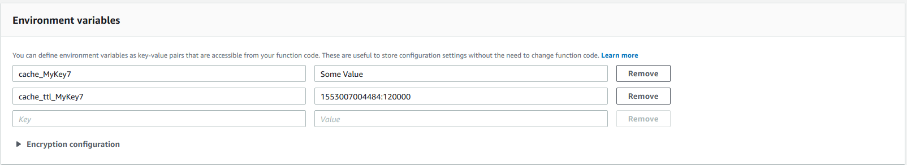

## AWS Lambda Serverless Cache
This module allows use process.env as cache with option of set ttl by key, this allows use a fast read cache in lambda functions. 

All k/v pairs will be setted as Environment, and will have the form:
* cache_key
* cache_ttl_key

### Example:


Every time that a key is getting from cache, then their TTL is validated and key can be removed if TTL is fulfilled.

<a name="ServerlessCacheManager"></a>

## ServerlessCacheManager
Class ServerlessCacheManager

**Kind**: global class  

- [AWS Lambda Serverless Cache](#aws-lambda-serverless-cache)
  - [Example:](#example)
- [ServerlessCacheManager](#serverlesscachemanager)
  - [new ServerlessCacheManager(context)](#new-serverlesscachemanagercontext)
  - [serverlessCacheManager.has(key) ⇒ <code>boolean</code>](#serverlesscachemanagerhaskey-%E2%87%92-codebooleancode)
  - [serverlessCacheManager.getValue(key) ⇒ <code>string</code>](#serverlesscachemanagergetvaluekey-%E2%87%92-codestringcode)
  - [serverlessCacheManager.putValues(kvArray)](#serverlesscachemanagerputvalueskvarray)
  - [serverlessCacheManager.putValue(key, value, options)](#serverlesscachemanagerputvaluekey-value-options)
  - [serverlessCacheManager.removeKey(key)](#serverlesscachemanagerremovekeykey)
  - [serverlessCacheManager.removeKeys(keysArray)](#serverlesscachemanagerremovekeyskeysarray)
  - [serverlessCacheManager.getKeyTTL(key)](#serverlesscachemanagergetkeyttlkey)
  - [serverlessCacheManager.getCacheSize(key)](#serverlesscachemanagergetcachesizekey)

<a name="new_ServerlessCacheManager_new"></a>

### new ServerlessCacheManager(context)

| Param | Type | Description |
| --- | --- | --- |
| context | <code>json</code> | AWS Lambda context |

<a name="ServerlessCacheManager+has"></a>

### serverlessCacheManager.has(key) ⇒ <code>boolean</code>
This method returns a boolean that says if specified key exists in cache

**Kind**: instance method of [<code>ServerlessCacheManager</code>](#ServerlessCacheManager)  

| Param | Type | Description |
| --- | --- | --- |
| key | <code>string</code> | String key to validate |

**Example**  
```js
const has = await ServerlessCacheManager.has("doniayape");
console.log("Result: ", has); //Result: true|false
```
<a name="ServerlessCacheManager+getValue"></a>

### serverlessCacheManager.getValue(key) ⇒ <code>string</code>
This method returns value from key, else returns undefined

**Kind**: instance method of [<code>ServerlessCacheManager</code>](#ServerlessCacheManager)  

| Param | Type | Description |
| --- | --- | --- |
| key | <code>string</code> | String key to find |

**Example**  
```js
await ServerlessCacheManager.putValue("doniayape", "Zazi");
const value = await ServerlessCacheManager.getValue("doniayape");
console.log("Result: ", value); //Result: Zazi
```
<a name="ServerlessCacheManager+putValues"></a>

### serverlessCacheManager.putValues(kvArray)
This method put bulks key/value in cache with optional ttl in milliseconds.

**Kind**: instance method of [<code>ServerlessCacheManager</code>](#ServerlessCacheManager)  

| Param | Type | Description |
| --- | --- | --- |
| kvArray | <code>Array</code> | Array of elements {key: "", value: "", options: {ttl: 0}} to put in cache |

**Example**  
```js
await ServerlessCacheManager.putValues([
 {
     key: "doniayape", 
     value: "Zazi"
 },
 {
     key: "bar", 
     value: "foo",
     options: {
         ttl: 20000
     }
 }
]);
```
<a name="ServerlessCacheManager+putValue"></a>

### serverlessCacheManager.putValue(key, value, options)
This method put key/value in cache with optional ttl in milliseconds.

**Kind**: instance method of [<code>ServerlessCacheManager</code>](#ServerlessCacheManager)  

| Param | Type | Description |
| --- | --- | --- |
| key | <code>string</code> | String with key |
| value | <code>string</code> | String with value of key |
| options | <code>json</code> | JSON with ttl property with ttl in milliseconds |

**Example**  
```js
await ServerlessCacheManager.putValue("bar", "foo", 
 {
     ttl: 20000
 }
);
```
<a name="ServerlessCacheManager+removeKey"></a>

### serverlessCacheManager.removeKey(key)
This method removes a key from cache

**Kind**: instance method of [<code>ServerlessCacheManager</code>](#ServerlessCacheManager)  

| Param | Type | Description |
| --- | --- | --- |
| key | <code>string</code> | String with key |

**Example**  
```js
await ServerlessCacheManager.removeKey("bar");
```
<a name="ServerlessCacheManager+removeKeys"></a>

### serverlessCacheManager.removeKeys(keysArray)
This method removes bulks of keys from cache

**Kind**: instance method of [<code>ServerlessCacheManager</code>](#ServerlessCacheManager)  

| Param | Type | Description |
| --- | --- | --- |
| keysArray | <code>Array</code> | String array with keys to remove |

**Example**  
```js
await ServerlessCacheManager.removeKeys(["bar", "doniayape"]);
```
<a name="ServerlessCacheManager+getKeyTTL"></a>

### serverlessCacheManager.getKeyTTL(key)
This method gets Time To Live from key

**Kind**: instance method of [<code>ServerlessCacheManager</code>](#ServerlessCacheManager)  

| Param | Type | Description |
| --- | --- | --- |
| key | <code>string</code> | String key to query ttl |

**Example**  
```js
const ttl ServerlessCacheManager.getKeyTTL("bar");
console.log(ttl); //TTL in miliseconds
```
<a name="ServerlessCacheManager+getCacheSize"></a>

### serverlessCacheManager.getCacheSize(key)
This method gets an estimated size in bytes of cache, aws lambda have size limits for k/v saved in env vars (4KB). [AWS Lambda Limits](https://docs.aws.amazon.com/lambda/latest/dg/limits.html)

**Kind**: instance method of [<code>ServerlessCacheManager</code>](#ServerlessCacheManager)  

| Param | Type | Description |
| --- | --- | --- |
| key | <code>string</code> | String key to query ttl |

**Example**  
```js
const ttl ServerlessCacheManager.getKeyTTL("bar");
console.log(ttl); //TTL in miliseconds
```
